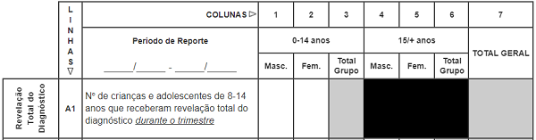

# Totalizador de Resumo Trimestral de APSS/PP

O **Totalizador de Resumo Trimestral de APSS/PP** é um serviço online gratuito que auxilia na elaboração, como o nome sugere, do resumo trimestral de APSS/PP (Apoio Psicossocial e Prevenção Positiva), por meio do cálculo automático dos totais com base nos dados preenchidos pelo usuário. Foi criado de acordo com o modelo da ficha de resumo trimestral de APSS/PP actualmente vigente no Serviço Nacional de Saúde em Moçambique.

## Objectivos

* Auxiliar os Profissionais de Saúde na totalização do resumo trimestral de APSS/PP com exatidão e prontidão;

* Minimizar possíveis erros de totalização (por exemplo, somar inconscientemente células não correspondentes ou registar o total da linha A, na linha B);

* Expandir o acesso à ficha de resumo trimestral de APSS/PP.

## O que eu preciso dispor para, e como utilizar o totalizador?

* Um celular ou computador com acesso à internet.

* Ter colhido os dados de todos os indicadores da ficha nas fontes primárias (livro(s) de registo diário das actividades de apoio psicossocial e prevenção positiva) da sua Unidade Sanitária.

* E por fim, preencher os dados nas células correspondentes em função das variáveis (indicador, sexo e faixa etária) e consequentemente os respectivos totais são, em tempo real, correcta e automaticamente calculados.

>[!NOTE]
>
> A utilização do totalizador é, de facto, uma garantia de um resumo correctamente totalizado, porém, isso simplesmente não define a qualidade do resumo. Você é o único responsável pela veracidade, lógica e concordância dos dados preenchidos e, portanto, pela qualidade do resumo. O totalizador só se limita a calcular os totais baseando-se exactamente nos dados que você fornece.

## Qual é o destino dos dados que eu insiro?

São guardados localmente (no navegador que estiver a usar), por meio de um recurso chamado [Web Storage](https://developer.mozilla.org/pt-BR/docs/Web/API/Web_Storage_API) e você tem total controle sobre esses, podendo mantê-los ou apagá-los por meio da opção "Esvaziar ficha" no menu do totalizador ou esvaziando o histórico (inclusíve os cookies) do seu navegador.

## Vantagens do totalizador

* Calcula automaticamente os totais;

* Preenche automaticamente as células correspondentes aos totais;

* Fornece resultados (totais) exactos;

* Flexibiliza a elaboração do resumo;

* Pode ser impresso, inclusíve como uma simples ficha de resumo mensal;

* Pode ser guardado como PDF.

## Limitações do totalizador

* Não alerta sobre discrepância de dados, portanto, a análise da concordância dos dados é inteiramente dependente do usuário.